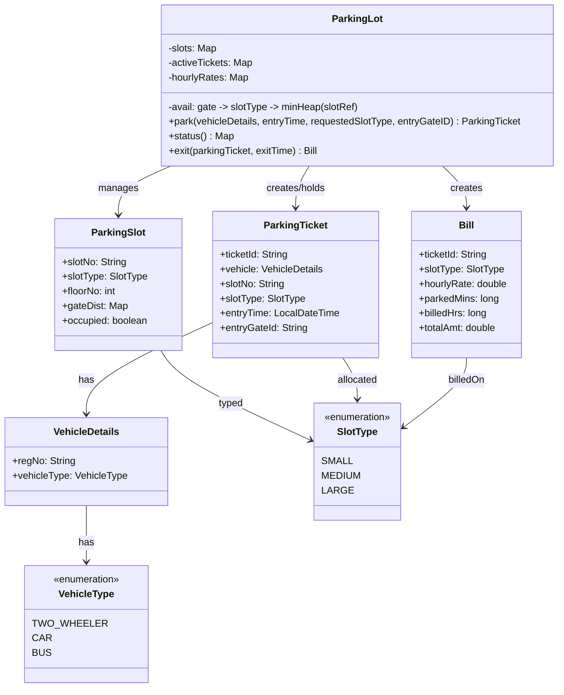

# Parking Lot - Class Diagram

```mermaid
classDiagram
    class ParkingLot {
      -slots: Map<String, ParkingSlot>
      -activeTickets: Map<String, ParkingTicket>
      -avail: gate -> slotType -> minHeap(slotRef)
      -hourlyRates: Map<SlotType, Double>
      +park(vehicleDetails, entryTime, requestedSlotType, entryGateID) ParkingTicket
      +status() Map<SlotType, Integer>
      +exit(parkingTicket, exitTime) Bill
    }

    class VehicleDetails {
      +regNo: String
      +vehicleType: VehicleType
    }

    class ParkingSlot {
      +slotNo: String
      +slotType: SlotType
      +floorNo: int
      +gateDist: Map<gateId, distance>
      +occupied: boolean
    }

    class ParkingTicket {
      +ticketId: String
      +vehicle: VehicleDetails
      +slotNo: String
      +slotType: SlotType
      +entryTime: LocalDateTime
      +entryGateId: String
    }

    class Bill {
      +ticketId: String
      +slotType: SlotType
      +hourlyRate: double
      +parkedMins: long
      +billedHrs: long
      +totalAmt: double
    }

    class VehicleType {
      <<enumeration>>
      TWO_WHEELER
      CAR
      BUS
    }

    class SlotType {
      <<enumeration>>
      SMALL
      MEDIUM
      LARGE
    }

    ParkingLot --> ParkingSlot : manages
    ParkingLot --> ParkingTicket : creates/holds
    ParkingLot --> Bill : creates
    ParkingTicket --> VehicleDetails : has
    VehicleDetails --> VehicleType : has
    ParkingSlot --> SlotType : typed
    ParkingTicket --> SlotType : allocated
    Bill --> SlotType : billedOn
```
